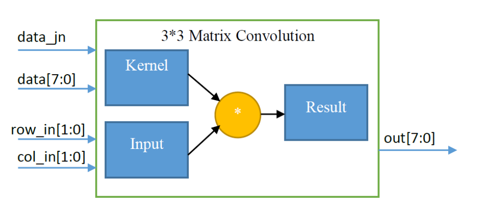
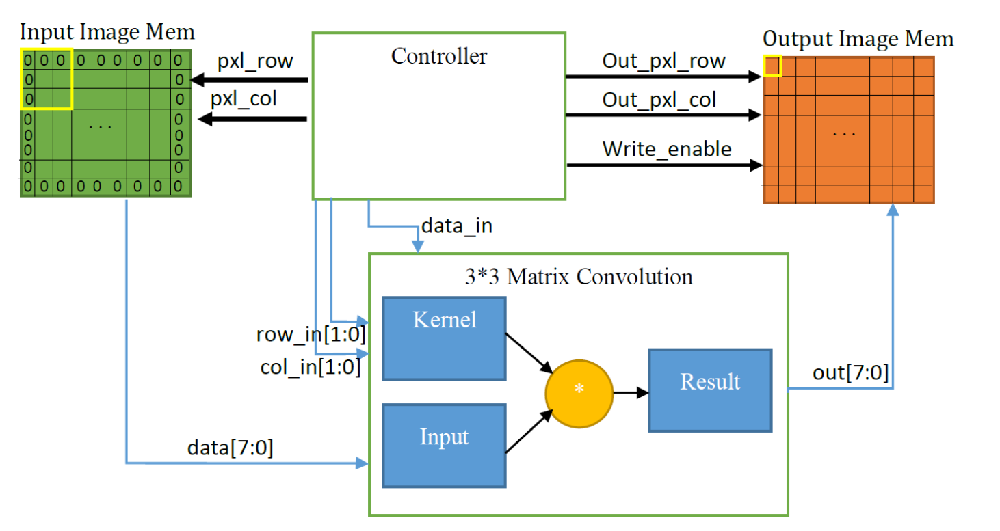
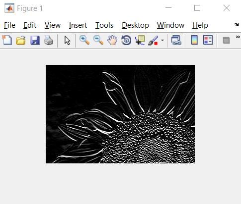

# FPGA-Based Convolution Module Design

This project involves designing a convolution module using Verilog on an FPGA to apply a specific filter to an image. 

## Sobel Filter for Edge Detection

In this project, the Sobel filter is used to detect edges in an image. The kernel applied is as follows:

 h = [[1, 2, ,1],[0, 0, 0],[-1, -2, -1]]

This kernel is stored in the FPGA as Read-Only Memory (ROM). The convolution operation is implemented using the hardware developed in the [Matrix Multiplication Project](https://github.com/MDKAM/Matrix-Multiplier_verilog_FPGA.git).

## Project Phases

The project is divided into three key phases:

1. **Convolution Module**: Designing and implementing the core convolution module.
2. **Controller Module**: Developing the controller to manage the convolution process.
3. **Main Module Integration**: Implementing the ROM and integrating all modules to create a functional system.

## System Schematics
Below are the schematics of the modules used in this project:

And here is the example input and output image:

